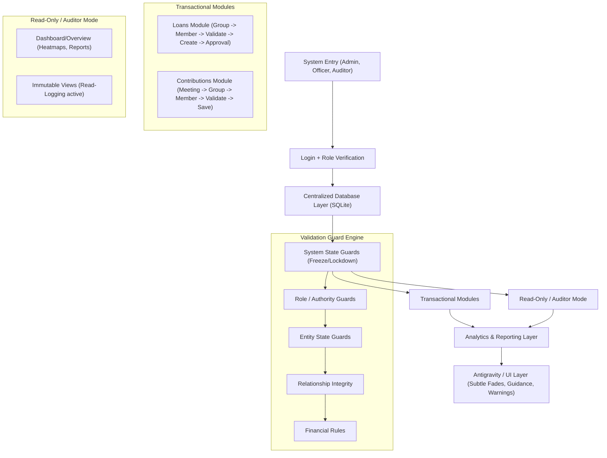

# UKOMBOZI TBMS – Professional Architecture & Workflow

## System Blueprint

---

## ✅ Workflow Details

### 1. Login & Security
- **Role Identification**: Assigns roles (Admin, Director, Field Officer, Auditor) to control navigation and action visibility.
- **JWT Authorization**: Secures every API request with mandatory token validation.

### 2. Validation Guard Engine
Every action (Mutation) must pass through these sequential layers:
1. **System State**: Is the system frozen or in a lockdown period?
2. **Role & Authority**: Does the user have `create` or `edit` permissions for this module?
3. **Entity State**: Is the target member/group active?
4. **Relationship Integrity**: Does the member belong to the specified group?
5. **Financial Rules**: Does the member have sufficient savings for the loan? Are contributions within limits?

### 3. Loans Workflow (Group → Member → Loan)
1. **Selection**: User selects a Group.
2. **Filtering**: System loads only active members belonging to that Group.
3. **Validation**: Checks membership status and previous loan history.
4. **Execution**: Creates a loan application (Atomic Insert).
5. **Process**: Moves to the Separate Approval module for verification.

### 4. Contributions Workflow (Meeting → Group → Member)
1. **Selection**: User selects an active Meeting Session.
2. **Locking**: Group is context-locked to that meeting.
3. **Member Entry**: Loads members for the specific Group.
4. **Saving**: Saves contribution data; updates reporting layer in real-time.

### 5. Auditor Mode (Immutable Access)
- **Strict Read-Only**: Backend blocks all POST/PUT/DELETE attempts with 403 Forbidden.
- **Traceability**: Every GET request made by an Auditor is logged in `audit_read_logs`.
- **UI Indicators**: Constant visual reminders of Auditor Status to prevent confusion.

### 6. Antigravity UI Principles
- **Motion Guidance**: Use subtle fades (200ms-300ms) for page transitions.
- **Financial Discipline**: No "success animations" (confetti, etc.) for money-related entries.
- **Authority**: Clean, high-contrast layouts emphasizing data accuracy.

---

## 🔑 Professional Implementation Principles
- **Single Source of Truth**: All data is fetched from the centralized SQLite database.
- **Separation of Concerns**: Logical boundary between Data Entry, Approval, and Reporting.
- **Immutable Audit Trail**: Guaranteed tracking for all critical system interactions.
- **Backend-First Security**: Guards are enforced at the API level, making the UI restrictions a secondary convenience layer.
