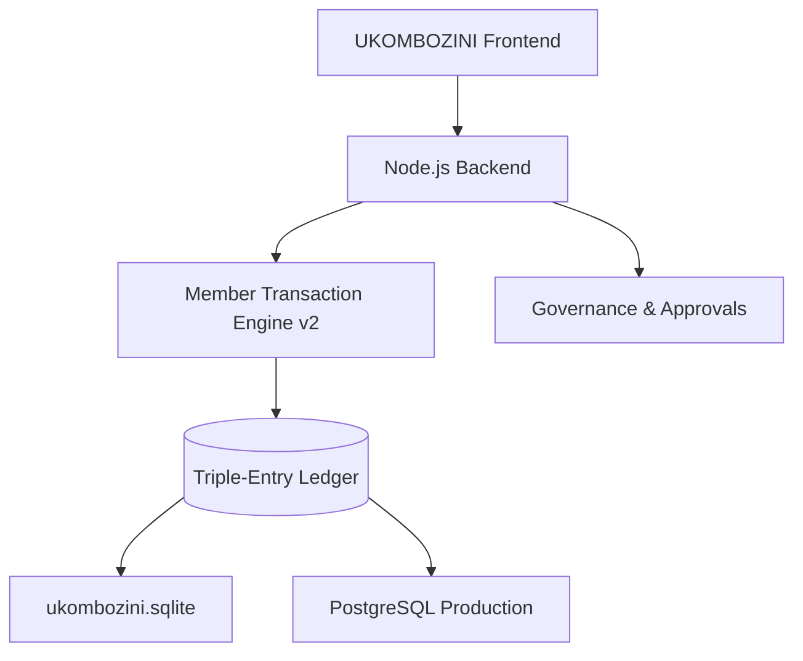

# 🗄️ UKOMBOZINI Database Architecture (v2.1) - Institutional Grade

## ✅ ARCHITECTURE: LOCAL SQLITE (DEV) & POSTGRESQL (PROD)

**Current Implementation:** The system leverages a high-performance **Local SQLite** database for development and field operations, with a fully compatible **PostgreSQL 15** schema designed for centralized institutional deployment.

---

## 🎯 INSTITUTIONAL ARCHITECTURE (v2.1)

### **Core Components:**

### **Evolution from v2.0:**
1.  **MTE v2 Integration:** Unified transaction engine that handles all Member, Group, and System movements in atomic blocks.
2.  **Supervisor Workflow:** Dual-control mechanism for high-variance meetings.
3.  **Triple-Entry Ledger:** Every transaction is recorded as Credit/Debit pairs across Member, Group, and System accounts simultaneously.

---

## 🏦 THE TRIPLE-ENTRY LEDGER (MTE v2)

We have moved from a simple transaction log to an accounting-grade ledger system.

### **1. Triple-Entry Principle:**
- **Layer 1: Member Account:** (e.g., Member Savings / Loan Balance)
- **Layer 2: Group Account:** (e.g., Group Operational Cash / Portfolio-at-Risk)
- **Layer 3: System Account:** (e.g., UKOMBOZINI Revenue / Welfare Reserves)

### **2. Execution Flow:**
When a member makes a loan repayment, MTE v2 executes:
1.  **CREDIT** Member Loan Account (Reduces debt)
2.  **DEBIT** Member Savings (If paid via savings) OR **CREDIT** Group Cash (If cash repayment)
3.  **DEBIT** Group Asset (Reduces Portfolio-at-Risk)
4.  **CREDIT** System Revenue (Interest portion)

This ensures **Zero-Variance Integrity**—money must be accounted for across all three layers.

---

## 🔐 GOVERNANCE & APPROVALS

### **1. Supervisor Workflow**
For meetings with significant variances (e.g., negative end-of-day balances), the system enforces a hardware lock:
- **Field Officer:** Submits for approval.
- **System:** Transitions to `PENDING_APPROVAL` and locks all entries.
- **Supervisor:** Reviews variance explanations and either **Releases** (Posts to Ledger) or **Rejects** (Unlocks for correction).

### **2. Risk Engine**
Integrated Risk Management tracks:
- **Repayment Compliance:** Real-time PAR (Portfolio at Risk) calculation.
- **Liquidity Guards:** Prevents disbursements that would exceed group-defined safety thresholds.

---

## 📊 DATA STORAGE STRATEGY

### **1. Development & Field Operations (SQLite)**
- **File:** `ukombozini.sqlite`
- **Zero-Config:** Optimized for performance on local field machines.
- **ACID Compliant:** Supports full transaction rollbacks via `sqlite3`.

### **2. Institutional Centralization (PostgreSQL)**
- **Target:** Production deployment via Docker.
- **Schema Parity:** Maintained via `backend/database/postgres_init.sql`.
- **Scalability:** Optimized for 100+ groups and 10,000+ members.

---

## 🛡️ SECURITY & INTEGRITY

### **1. Atomic Operations**
All financial operations use `BEGIN TRANSACTION` / `COMMIT`. If any leg of a triple-entry fail, the entire session is rolled back.

### **2. Audit Trail**
The `audit_logs` table records every critical action:
- `SESSION_RELEASED`
- `REVERSAL_APPROVED`
- `LIQUIDITY_LIMIT_BYPASS`

---

## ✅ CONCLUSION

**UKOMBOZINI v2.1 is an Accounting-Grade Enterprise Platform.**

✅ **Ledger Integrity:** MTE v2 Triple-Entry System  
✅ **Dual Control:** Supervisor Workflow Integration  
✅ **Resiliency:** Local SQLite + Postgres Production Parity  
✅ **Transparency:** Real-time Risk & Audit Monitoring  

---

**Document Version:** 2.1  
**Last Updated:** 13 February 2026  
**Architecture:** MTE v2 Centralized Ledger  
**Security Level:** Institutional ✅
