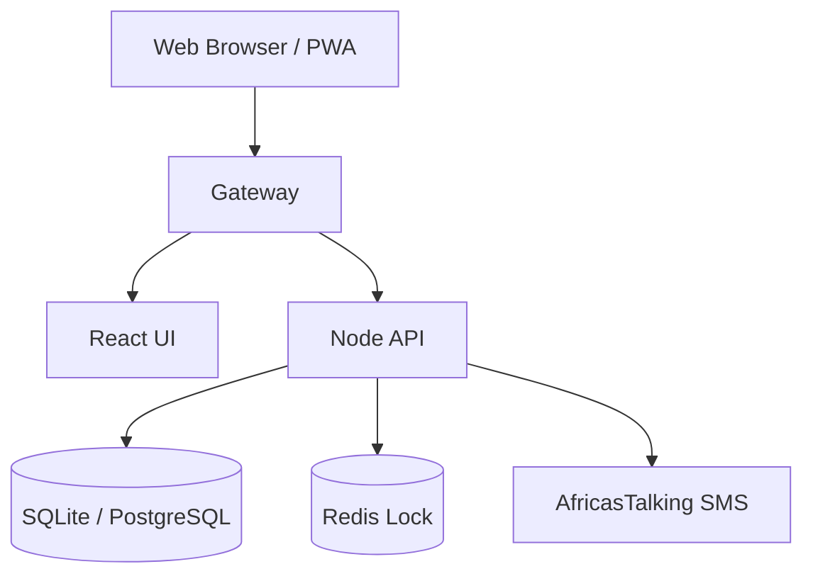

# 🎊 UKOMBOZINI TBMS - PROJECT COMPLETE!

## ✅ FINAL STATUS: PRODUCTION READY (v3.0)

**Project Name:** UKOMBOZINI Treasury & Business Management System  
**Completion Date:** 11 February 2026  
**Version:** 3.0.0 (Institutional Growth Edition)  
**Status:** 🟢 **READY FOR DOCKER & FIELD DEPLOYMENT**

---

## 🏆 PROJECT ACHIEVEMENTS (v3.0 REFINEMENTS)

The final phase of development (v3.0) focused on **Institutional Financial Integrity** and **Zero-Base Table Banking**.

✅ **Real-time Table Balance Validation**: Implemented strict guards in the Digital Cashbook to prevent disbursements from exceeding liquid cash on-hand.
✅ **Partnership Repayment Ledger Consistency**: Standardized company capital returns as cash outflows, ensuring perfect daily reconciliation.
✅ **Global UKOMBOZINI Rebranding**: 100% of legacy brand references updated across UI, SMS templates, and audit logs.
✅ **Offline-First PWA Resilience**: Hardened local draft recovery and background auto-save for rural field operations.
✅ **Instituional Surplus Matrix**: Automated allocation of weekly growth into STL, LTL, Dividend, and Project reserves.

---

## 📊 CORE FEATURES RECAP

### **1. Institutional Digital Cashbook** ✅
- **Excel-like Performance**: Optimized for fast data entry.
- **Max Allowed Indicators**: Real-time visual aids showing disbursement limits.
- **Liquid Cash Tracker**: Live monitoring of "Cash in the Room".

### **2. Member Transaction Engine (MTE v2)** ✅
- **Triple-Entry Accounting**: Immutable financial logs ensuring 100% audit accuracy across Member, Group, and System ledgers.
- **Atomic Execution**: All-or-nothing transaction security.

### **3. Offline-First Resilience** ✅
- **IndexedDB Vault**: Secure local storage for pending transactions.
- **Auto-Recovery**: Prompts to restore unsaved data after power or system failures.

### **4. Reporting & Governance** ✅
- **Auditor Mode**: Traceable, read-only audit access.
- **SMS Automation**: Real-time receipting and official closeout summaries.
- **Risk Command Center**: Monitoring tool for group liquidity and member risk scores.

---

## 📁 SYSTEM ARCHITECTURE



---

## 🚀 LAUNCH INSTRUCTIONS

### **Option 1: Windows (Recommended)**
1.  Ensure **Docker Desktop** is running.
2.  Double-click `start_ukombozini.bat`.
3.  The system will launch automatically at `http://localhost`.

### **Option 2: Terminal (Manual)**
```bash
# Start Docker Stack
docker-compose up --build -d
```

---

## 🎉 THE SYSTEM IS YOURS!

**UKOMBOZINI is now a fully Hardened, Institutional-Grade Platform.**

You have successfully transitioned from manual tracking to a **Triple-Entry, Offline-Capable, Bank-Grade Management System**.

**DEPLOY. LAUNCH. TRANSFORM. 💪🎊**

---
*© 2026 UKOMBOZINI TBMS. Optimized for Institutional Excellence.*
